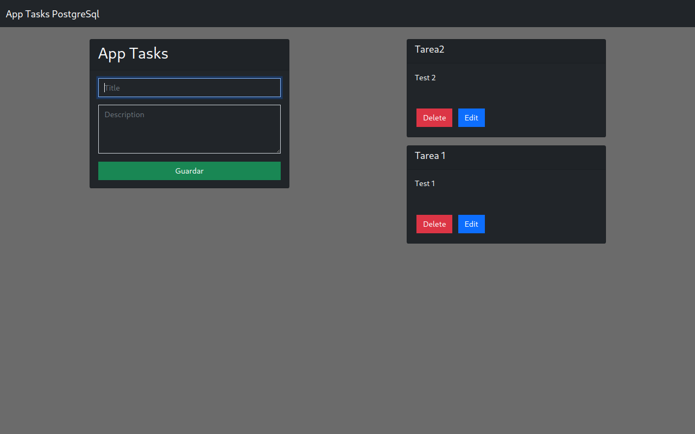

# Tasks App PostgreSql
_Estas instrucciones te permitirán obtener una copia del proyecto en funcionamiento en tu máquina local para propósitos de desarrollo y pruebas._



### Pre-requisitos
Cosas que necesitas para instalar el software

* Postgres

* Node.js

* Git -Solo si se va a clonar el repositorio

### Instalacion 🔧
_Serie de pasos para ejecutar en local y en entorno de desarrollo_

* Estar en la carpeta del Archivo clonado
* Abrir consola de comandos -- Windows/Linux/Mac

#### Clonar el repositorio o descargar el ZIP
```
git clone https://github.com/denis360/task-nodejs-postgresql.git
```

#### Instalar dependencias correspondientes
* Ir a la carpeta y ejecutar
```
npm install
```

#### Iniciar Postgres
* Si estas en windows abre tu SQL Shell o pgAdmin
* Si estas en linux ejecuta:
```
sudo systemctl enable postgresql
```
```
sudo systemctl start postgresql
```

* Ejecutar en la terminal de comandos
```
sudo -u postgres psql
```

### Crear las tablas de Postgres
* Crear la base de datos
```
CREATE DATABASE database_tasks;
```
* Cambiar a la base de datos creada
```
\c database_tasks;
```
* Crear la tabla para las tareas
```
CREATE TABLE tasks(
  id SERIAL PRIMARY KEY,
  name VARCHAR(50),
  description TEXT
);
```

#### Iniciar en local y en entorno de desarrollo 🛠
* En otra terminal de comandos ejecutar:
```
npm run dev
```

* Ir a tu navegador a la ruta http://localhost:3000

## Construido con:
* [Node.js](https://nodejs.org/es/)
* [PostgreSQL](https://www.postgresql.org/)
* [Express](https://expressjs.com/es/)
* [Handlebars](https://handlebarsjs.com/)
